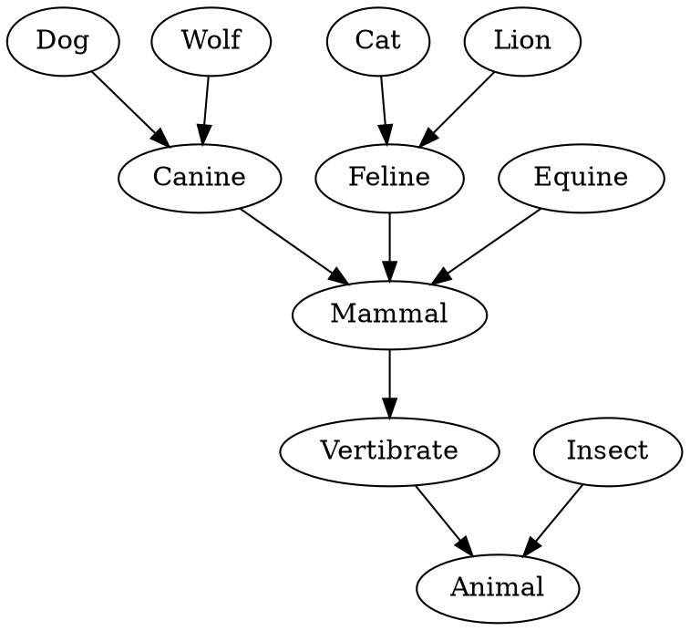
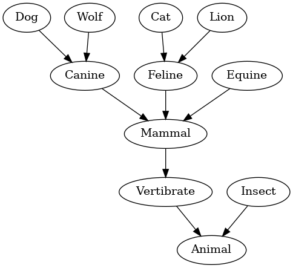

# Graphviz Previewer Web

This extension allows you to preview Graphviz dot files with no external dependencies.

## Features



If you have a Graphviz dot file open in an editor you can open the command palette and type "Graphviz: Preview Dot File" and a preview of the generated graph will open.



## Requirements

This extension has no external dependencies so works on [VSCode web](https://code.visualstudio.com/docs/editor/vscode-web).

## Extension Settings

This extension currently has no settings.

## Known Issues

This largely untested extension probably has many bugs, edge cases, and scope for improvement. Please report any issues at https://github.com/IJMacD/graphviz-previewer-web

## Licences

```
Viz.js 2.1.2 (Graphviz 2.40.1, Expat 2.2.5, Emscripten 1.37.36)
Copyright (c) 2014-2018 Michael Daines
Licensed under MIT license

This distribution contains other software in object code form:

Graphviz
Licensed under Eclipse Public License - v 1.0
http://www.graphviz.org

Expat
Copyright (c) 1998, 1999, 2000 Thai Open Source Software Center Ltd and Clark Cooper
Copyright (c) 2001, 2002, 2003, 2004, 2005, 2006 Expat maintainers.
Licensed under MIT license
http://www.libexpat.org

zlib
Copyright (C) 1995-2013 Jean-loup Gailly and Mark Adler
http://www.zlib.net/zlib_license.html
```